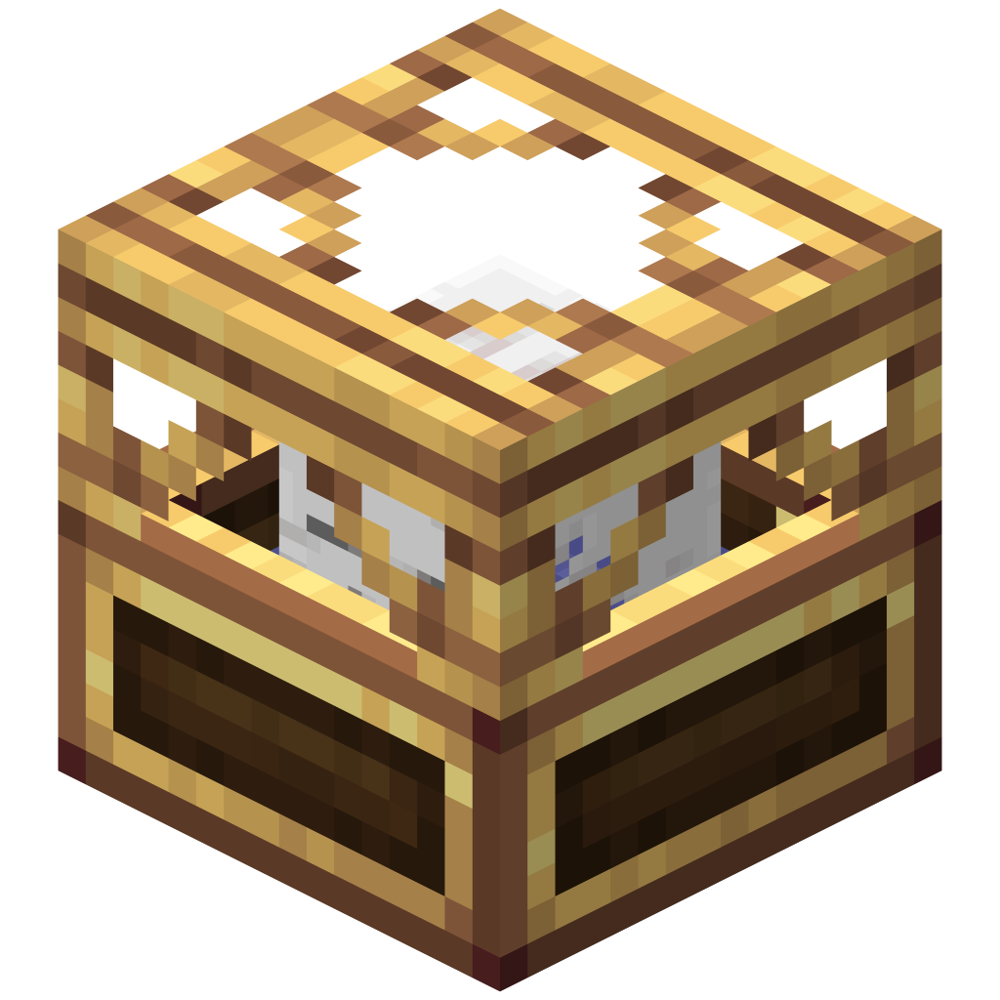

# About

This projects revamps the textures as well as the recipes from the [Aeronautic Additions and ChunkLoader](https://modrinth.com/mod/aeronautic-additions-and-chunkloader) mod.
This repository contains a resource pack, a data pack and a mod containing both for easier access.

The resource pack adds new textures for the "Player Compass" and the "Directional Compass":

 

It also adds a new model for the "Aeronautic Chunk Loader" focusing more on the Create aesthetic:

Texture, model and recipe tweaks to the [Aeronautic Additions and ChunkLoader](https://modrinth.com/mod/aeronautic-additions-and-chunkloader) mod
